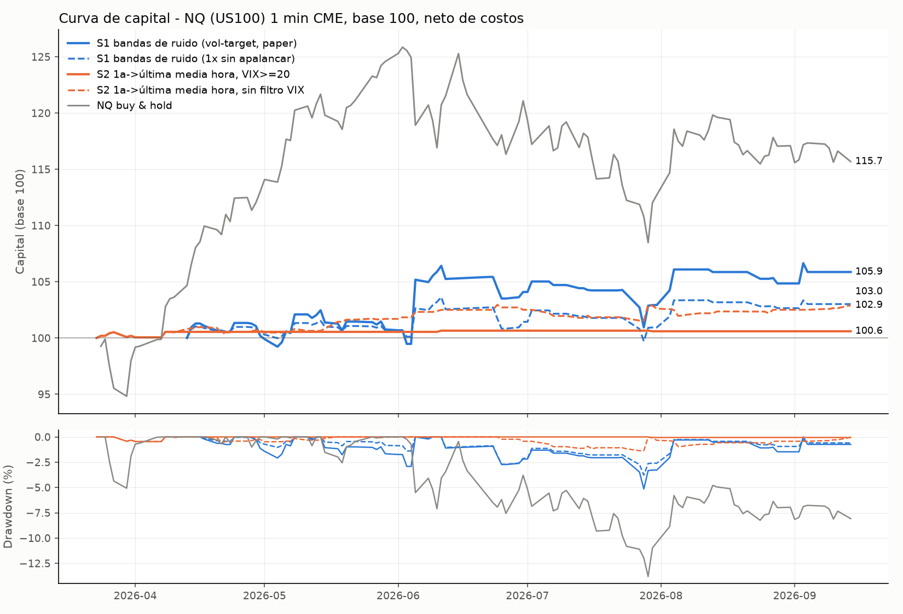

# Backtest: momentum intradía en el US100 (futuro NQ, CME, velas de 1 minuto)

Generado por `scripts/run_intraday_strategies.py`. Todas las cifras son **netas de costos** (0.375 pt por lado y contrato = 1 tick de slippage + ~2.50 USD de comisión) y con ejecución en la apertura de la vela siguiente a la señal (sin look-ahead).

## Resultados principales

| Estrategia | Ventana | Días | Trades | Retorno total | CAGR | Vol. anual | Sharpe | **Sortino** | Máx. DD | **Alfa anual** (t) | **Beta** | Win rate | Profit factor | IC 90 % Sharpe | P(media≤0) | Retorno sin el mejor día |
|---|---|---|---|---|---|---|---|---|---|---|---|---|---|---|---|---|
| S1 bandas de ruido (vol-target, paper) | 2026-04-13 → 2026-09-14 | 103 | 75 | 5.87% | 15.0% | 12.8% | 1.16 | **2.54** | -5.14% | **15.5%** (0.73) | **-0.03** | 39% | 1.31 | [-1.12, 2.89] | 0.18 | 0.13% |
| S1 bandas de ruido (1x sin apalancar) | 2026-04-13 → 2026-09-14 | 103 | 75 | 3.02% | 7.5% | 7.2% | 1.05 | **1.93** | -3.78% | **7.1%** (0.59) | **0.00** | 39% | 1.24 | [-1.30, 3.12] | 0.22 | 0.48% |
| S2 1a->última media hora, VIX>=20 | 2026-03-23 → 2026-09-14 | 117 | 9 | 0.60% | 1.3% | 1.1% | 1.16 | **1.93** | -0.46% | **1.1%** (0.90) | **0.01** | 67% | 1.96 | [-0.78, 2.86] | 0.15 | 0.11% |
| S2 1a->última media hora, sin filtro VIX | 2026-03-23 → 2026-09-14 | 117 | 61 | 2.91% | 6.4% | 3.2% | 1.94 | **3.77** | -1.36% | **6.8%** (1.54) | **-0.01** | 61% | 1.66 | [-0.04, 3.93] | 0.05 | 1.53% |
| NQ buy & hold (benchmark) | 2026-03-24 → 2026-09-14 | 118 | 0 | 15.69% | 36.5% | 22.4% | 1.50 | **2.29** | -13.81% | — | **1.00** | n/a | n/a | [-0.88, 4.12] | 0.15 | 11.90% |

Alfa y beta: regresión OLS diaria `r_estrategia = α + β·r_NQ` con errores Newey-West (5 rezagos); α anualizada ×252, entre paréntesis su estadístico t (|t| > 2 ≈ significativo al 5 %). Benchmark = NQ comprado y mantenido (cierre a cierre de la sesión regular). Sharpe/Sortino con rf = 0 porque el P&L de un futuro ya es retorno en exceso. Sortino = media / desviación a la baja (MAR = 0) × √252. IC 90 % y P(media≤0) por bootstrap por bloques (5 000 réplicas, bloque medio de 5 días). CAGR anualiza un periodo de < 6 meses: tómalo como referencia, no como expectativa.

### Misma ventana para todas (desde que S1 termina su calentamiento de 14 días)

| Estrategia | Ventana | Trades | Retorno | Sharpe | Sortino | Máx. DD | Alfa anual (t) | Beta |
|---|---|---|---|---|---|---|---|---|
| S1 bandas de ruido (vol-target, paper) | 2026-04-13 → 2026-09-14 | 75 | 5.87% | 1.16 | 2.54 | -5.14% | 15.5% (0.73) | -0.03 |
| S1 bandas de ruido (1x sin apalancar) | 2026-04-13 → 2026-09-14 | 75 | 3.02% | 1.05 | 1.93 | -3.78% | 7.1% (0.59) | 0.00 |
| S2 1a->última media hora, VIX>=20 | 2026-04-13 → 2026-09-14 | 2 | 0.05% | 0.68 | 1.51 | -0.05% | 0.1% (0.42) | 0.00 |
| S2 1a->última media hora, sin filtro VIX | 2026-04-13 → 2026-09-14 | 53 | 2.40% | 1.81 | 3.63 | -1.36% | 6.5% (1.40) | -0.02 |
| NQ buy & hold (benchmark) | 2026-04-13 → 2026-09-14 | 0 | 11.63% | 1.31 | 1.97 | -13.81% | — | 1.00 |

### Estabilidad por sub-periodo (mitades)

| Estrategia | Mitad | Retorno | Sharpe | Sortino | Máx. DD |
|---|---|---|---|---|---|
| S1 bandas de ruido (vol-target, paper) | 1a mitad (2026-04-13 → 2026-06-30) | 4.09% | 1.35 | 3.32 | -2.92% |
| S1 bandas de ruido (vol-target, paper) | 2a mitad (2026-07-01 → 2026-09-14) | 1.71% | 0.92 | 1.64 | -3.88% |
| S1 bandas de ruido (1x sin apalancar) | 1a mitad (2026-04-13 → 2026-06-30) | 1.44% | 0.91 | 1.66 | -2.70% |
| S1 bandas de ruido (1x sin apalancar) | 2a mitad (2026-07-01 → 2026-09-14) | 1.56% | 1.22 | 2.35 | -2.67% |
| S2 1a->última media hora, VIX>=20 | 1a mitad (2026-03-23 → 2026-06-12) | 0.65% | 1.81 | 3.02 | -0.46% |
| S2 1a->última media hora, VIX>=20 | 2a mitad (2026-06-22 → 2026-09-14) | -0.05% | -2.07 | -2.07 | -0.05% |
| S2 1a->última media hora, sin filtro VIX | 1a mitad (2026-03-23 → 2026-06-12) | 2.50% | 3.91 | 6.99 | -0.58% |
| S2 1a->última media hora, sin filtro VIX | 2a mitad (2026-06-22 → 2026-09-14) | 0.40% | 0.49 | 1.00 | -1.36% |

## Robustez

**S1** — 36 variantes (lookback 10/14/20 × sizing vol-target/1x × ejecución siguiente-apertura/precio-de-señal × costos 0/1x/2x), todas medidas desde 2026-04-20 para que la ventana sea idéntica: Sharpe mediano 0.27, rango [-0.70, 1.04]; 26/36 variantes con retorno positivo.

| Lookback | Sharpe vol-target | Sharpe 1x | Sortino vol-target | Sortino 1x | Retorno vol-target | Retorno 1x |
|---|---|---|---|---|---|---|
| 10.0 | 0.34 | 0.22 | 0.75 | 0.40 | 1.65% | 0.52% |
| 14.0 | 0.98 | 0.78 | 2.14 | 1.42 | 4.74% | 2.12% |
| 20.0 | 0.06 | -0.60 | 0.12 | -0.95 | -0.01% | -1.76% |

**S2** — filtro VIX (sin filtro / ≥15 / ≥20 / ≥25) × definición de la primera media hora (cierre previo→10:00 como en el paper, o 09:30→10:00) × ejecución × costos:

| Filtro VIX | 1a media hora | Trades | Win rate | Retorno | Sharpe | Sortino | Alfa anual | Beta |
|---|---|---|---|---|---|---|---|---|
| sin filtro | prev_close | 61 | 61% | 2.91% | 1.94 | 3.77 | 6.8% | -0.01 |
| sin filtro | open | 62 | 47% | -1.26% | -0.84 | -1.29 | -2.7% | -0.00 |
| ≥ 15 | prev_close | 58 | 59% | 2.55% | 1.71 | 3.31 | 6.0% | -0.01 |
| ≥ 15 | open | 58 | 45% | -1.51% | -1.03 | -1.56 | -3.3% | -0.00 |
| ≥ 20 | prev_close | 9 | 67% | 0.60% | 1.16 | 1.93 | 1.1% | 0.01 |
| ≥ 20 | open | 10 | 50% | 0.05% | 0.12 | 0.16 | 0.1% | 0.00 |
| ≥ 25 | prev_close | 7 | 71% | 0.55% | 1.08 | 1.77 | 1.0% | 0.00 |
| ≥ 25 | open | 6 | 50% | -0.25% | -0.70 | -0.80 | -0.6% | 0.00 |

Tabla completa en `robustness.csv`.

## Datos: fuente, limpieza y validación

* Fuente: CME Globex vía Databento (`GLBX.MDP3`, `ohlcv-1m`, símbolo continuo `NQ.c.0`), rama `data-exports` de este repo. VIX diario: CBOE vía `datasets/finance-vix` (GitHub).
* Solo se usa la sesión regular 09:30-16:00 ET (390 velas/día). Datos limpios en `data/clean/NQ_rth_1m_clean.csv.gz` y banderas por día en `data/clean/NQ_daily_flags.csv`.

Bitácora de chequeos:

* Velas crudas: 173,463 (2026-03-18 20:00:00-04:00 -> 2026-09-14 19:59:00-04:00)
* Timestamps duplicados eliminados: 0
* Velas con OHLC inconsistente / no positivo / NaN eliminadas: 0
* Roll detectado en vencimiento 2026-03-20: último precio contrato viejo 24284.25 (03-20 09:29) -> primero del nuevo 23902.00 (03-22 18:00), salto -1.57% (incluye base, no se usa)
* Roll detectado en vencimiento 2026-06-18: último precio contrato viejo 30275.25 (06-18 09:29) -> primero del nuevo 30690.00 (06-18 20:00), salto +1.37% (incluye base, no se usa)
* 2026-05-25: día NO hábil de contado (feriado NYSE, futuro con sesión recortada, 210 velas RTH) -> excluido
* 2026-06-19: día NO hábil de contado (feriado NYSE, futuro con sesión recortada, 210 velas RTH) -> excluido
* 2026-07-03: día NO hábil de contado (feriado NYSE, futuro con sesión recortada, 210 velas RTH) -> excluido
* 2026-09-07: día NO hábil de contado (feriado NYSE, futuro con sesión recortada, 210 velas RTH) -> excluido
* 2026-03-19: contrato en semana de vencimiento, volumen RTH 22,375 (6% de la mediana) -> no operable
* 2026-06-15: contrato en semana de vencimiento, volumen RTH 98,742 (26% de la mediana) -> no operable
* 2026-06-16: contrato en semana de vencimiento, volumen RTH 55,243 (14% de la mediana) -> no operable
* 2026-06-17: contrato en semana de vencimiento, volumen RTH 26,211 (7% de la mediana) -> no operable
* 2026-03-19: cierre previo pertenece a otro contrato (o no existe) -> retornos close-to-close y gaps de ese día se invalidan
* 2026-03-23: cierre previo pertenece a otro contrato (o no existe) -> retornos close-to-close y gaps de ese día se invalidan
* 2026-06-22: cierre previo pertenece a otro contrato (o no existe) -> retornos close-to-close y gaps de ese día se invalidan
* 2026-03-20: día hábil sin sesión RTH en NQ.c.0 (vencimiento del contrato a las 09:30) -> sin datos
* 2026-06-18: día hábil sin sesión RTH en NQ.c.0 (vencimiento del contrato a las 09:30) -> sin datos
* Días con sesión RTH: 125; hábiles de contado: 121; operables: 117; minutos faltantes rellenados en días operables (máx/día): 0
