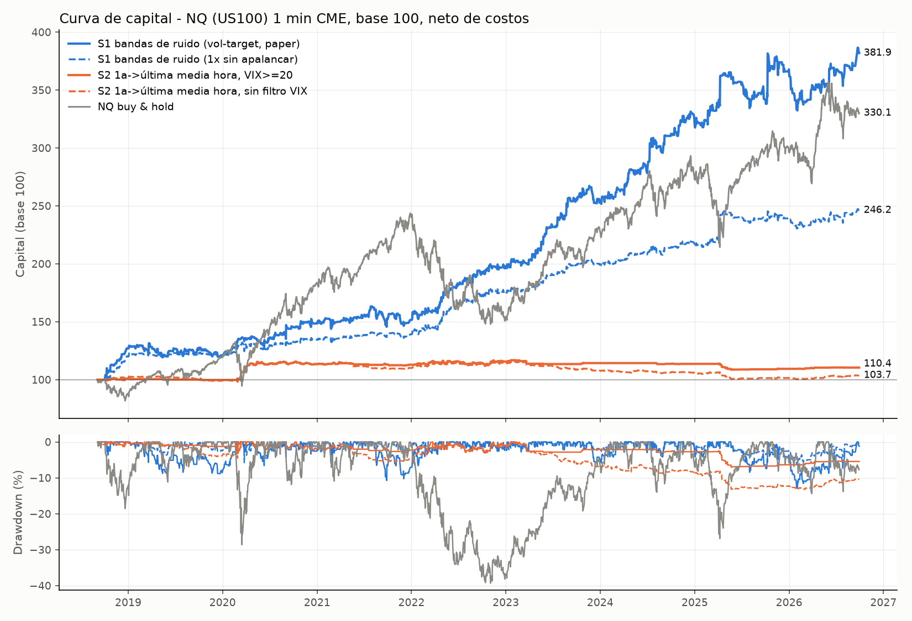

# Backtest: momentum intradía en el US100 (futuro NQ, CME, velas de 1 minuto)

Generado por `scripts/run_intraday_strategies.py`. Todas las cifras son **netas de costos** (0.375 pt por lado y contrato = 1 tick de slippage + ~2.50 USD de comisión) y con ejecución en la apertura de la vela siguiente a la señal (sin look-ahead).

## Resultados principales

| Estrategia | Ventana | Días | Trades | Retorno total | CAGR | Vol. anual | Sharpe | **Sortino** | Máx. DD | **Alfa anual** (t) | **Beta** | Win rate | Profit factor | IC 90 % Sharpe | P(media≤0) | Retorno sin el mejor día |
|---|---|---|---|---|---|---|---|---|---|---|---|---|---|---|---|---|
| S1 bandas de ruido (vol-target, paper) | 2018-10-02 → 2026-09-29 | 1859 | 1522 | 281.91% | 19.9% | 14.4% | 1.34 | **2.63** | -12.90% | **20.6%** (4.38) | **-0.03** | 40% | 1.32 | [0.86, 1.80] | 0.00 | 244.63% |
| S1 bandas de ruido (1x sin apalancar) | 2018-10-02 → 2026-09-29 | 1859 | 1522 | 146.17% | 13.0% | 9.0% | 1.40 | **2.76** | -6.15% | **13.0%** (4.76) | **0.01** | 40% | 1.35 | [0.95, 1.82] | 0.00 | 126.30% |
| S2 1a->última media hora, VIX>=20 | 2018-09-04 → 2026-09-29 | 1873 | 380 | 10.43% | 1.3% | 3.8% | 0.37 | **0.64** | -7.08% | **0.8%** (0.61) | **0.02** | 49% | 1.18 | [-0.29, 0.92] | 0.18 | 5.09% |
| S2 1a->última media hora, sin filtro VIX | 2018-09-04 → 2026-09-29 | 1873 | 991 | 3.69% | 0.5% | 4.3% | 0.13 | **0.22** | -13.28% | **0.2%** (0.13) | **0.02** | 48% | 1.04 | [-0.55, 0.72] | 0.39 | -1.33% |
| NQ buy & hold (benchmark) | 2018-09-05 → 2026-09-29 | 1961 | 0 | 230.08% | 16.6% | 24.4% | 0.75 | **1.07** | -39.31% | — | **1.00** | n/a | n/a | [0.21, 1.32] | 0.01 | 195.30% |

Alfa y beta: regresión OLS diaria `r_estrategia = α + β·r_NQ` con errores Newey-West (5 rezagos); α anualizada ×252, entre paréntesis su estadístico t (|t| > 2 ≈ significativo al 5 %). Benchmark = NQ comprado y mantenido (cierre a cierre de la sesión regular). Sharpe/Sortino con rf = 0 porque el P&L de un futuro ya es retorno en exceso. Sortino = media / desviación a la baja (MAR = 0) × √252. IC 90 % y P(media≤0) por bootstrap por bloques (5 000 réplicas, bloque medio de 5 días). 

### Misma ventana para todas (desde que S1 termina su calentamiento de 14 días)

| Estrategia | Ventana | Trades | Retorno | Sharpe | Sortino | Máx. DD | Alfa anual (t) | Beta |
|---|---|---|---|---|---|---|---|---|
| S1 bandas de ruido (vol-target, paper) | 2018-10-02 → 2026-09-29 | 1522 | 281.91% | 1.34 | 2.63 | -12.90% | 20.6% (4.38) | -0.03 |
| S1 bandas de ruido (1x sin apalancar) | 2018-10-02 → 2026-09-29 | 1522 | 146.17% | 1.40 | 2.76 | -6.15% | 13.0% (4.76) | 0.01 |
| S2 1a->última media hora, VIX>=20 | 2018-10-02 → 2026-09-29 | 380 | 10.43% | 0.37 | 0.64 | -7.08% | 0.8% (0.61) | 0.02 |
| S2 1a->última media hora, sin filtro VIX | 2018-10-02 → 2026-09-29 | 986 | 4.40% | 0.16 | 0.26 | -13.28% | 0.3% (0.19) | 0.02 |
| NQ buy & hold (benchmark) | 2018-10-02 → 2026-09-29 | 0 | 228.61% | 0.75 | 1.07 | -39.31% | — | 1.00 |

### Estabilidad por sub-periodo

| Estrategia | Periodo | Retorno | Sharpe | Sortino | Máx. DD |
|---|---|---|---|---|---|
| S1 bandas de ruido (vol-target, paper) | 2018 (2018-10-02 → 2018-12-31) | 26.93% | 5.03 | 16.24 | -3.63% |
| S1 bandas de ruido (vol-target, paper) | 2019 (2019-01-02 → 2019-12-31) | -5.23% | -0.42 | -0.66 | -8.82% |
| S1 bandas de ruido (vol-target, paper) | 2020 (2020-01-02 → 2020-12-31) | 23.42% | 1.53 | 3.74 | -6.59% |
| S1 bandas de ruido (vol-target, paper) | 2021 (2021-01-04 → 2021-12-31) | 2.11% | 0.22 | 0.33 | -10.73% |
| S1 bandas de ruido (vol-target, paper) | 2022 (2022-01-03 → 2022-12-30) | 30.57% | 2.29 | 4.45 | -4.36% |
| S1 bandas de ruido (vol-target, paper) | 2023 (2023-01-03 → 2023-12-29) | 27.75% | 2.27 | 4.75 | -5.64% |
| S1 bandas de ruido (vol-target, paper) | 2024 (2024-01-02 → 2024-12-31) | 27.10% | 2.11 | 4.52 | -4.17% |
| S1 bandas de ruido (vol-target, paper) | 2025 (2025-01-02 → 2025-12-31) | 14.44% | 0.92 | 2.18 | -8.45% |
| S1 bandas de ruido (vol-target, paper) | 2026 (2026-01-02 → 2026-09-29) | 3.83% | 0.49 | 0.88 | -8.10% |
| S1 bandas de ruido (1x sin apalancar) | 2018 (2018-10-02 → 2018-12-31) | 19.98% | 5.23 | 17.05 | -2.57% |
| S1 bandas de ruido (1x sin apalancar) | 2019 (2019-01-02 → 2019-12-31) | 0.43% | 0.11 | 0.20 | -3.64% |
| S1 bandas de ruido (1x sin apalancar) | 2020 (2020-01-02 → 2020-12-31) | 11.59% | 1.17 | 2.10 | -5.78% |
| S1 bandas de ruido (1x sin apalancar) | 2021 (2021-01-04 → 2021-12-31) | 3.48% | 0.58 | 0.84 | -3.39% |
| S1 bandas de ruido (1x sin apalancar) | 2022 (2022-01-03 → 2022-12-30) | 26.53% | 2.13 | 4.00 | -3.13% |
| S1 bandas de ruido (1x sin apalancar) | 2023 (2023-01-03 → 2023-12-29) | 13.14% | 2.14 | 4.26 | -2.33% |
| S1 bandas de ruido (1x sin apalancar) | 2024 (2024-01-02 → 2024-12-31) | 8.48% | 1.44 | 2.57 | -3.39% |
| S1 bandas de ruido (1x sin apalancar) | 2025 (2025-01-02 → 2025-12-31) | 10.88% | 1.02 | 2.83 | -4.20% |
| S1 bandas de ruido (1x sin apalancar) | 2026 (2026-01-02 → 2026-09-29) | 2.74% | 0.62 | 1.06 | -3.78% |
| S2 1a->última media hora, VIX>=20 | 2018 (2018-09-04 → 2018-12-31) | 0.99% | 0.80 | 1.40 | -1.34% |
| S2 1a->última media hora, VIX>=20 | 2019 (2019-01-02 → 2019-12-31) | -1.26% | -1.77 | -1.89 | -1.14% |
| S2 1a->última media hora, VIX>=20 | 2020 (2020-01-02 → 2020-12-31) | 13.74% | 1.69 | 3.58 | -2.67% |
| S2 1a->última media hora, VIX>=20 | 2021 (2021-01-04 → 2021-12-31) | -0.45% | -0.23 | -0.35 | -2.21% |
| S2 1a->última media hora, VIX>=20 | 2022 (2022-01-03 → 2022-12-30) | 2.28% | 0.57 | 0.87 | -3.05% |
| S2 1a->última media hora, VIX>=20 | 2023 (2023-01-03 → 2023-12-29) | -1.02% | -0.46 | -0.50 | -2.84% |
| S2 1a->última media hora, VIX>=20 | 2024 (2024-01-02 → 2024-12-31) | -0.61% | -0.81 | -0.90 | -0.78% |
| S2 1a->última media hora, VIX>=20 | 2025 (2025-01-02 → 2025-12-31) | -3.75% | -1.66 | -1.80 | -4.71% |
| S2 1a->última media hora, VIX>=20 | 2026 (2026-01-02 → 2026-09-29) | 0.99% | 1.36 | 2.46 | -0.46% |
| S2 1a->última media hora, sin filtro VIX | 2018 (2018-09-04 → 2018-12-31) | 2.84% | 1.79 | 3.27 | -1.00% |
| S2 1a->última media hora, sin filtro VIX | 2019 (2019-01-02 → 2019-12-31) | -3.59% | -1.68 | -2.01 | -4.08% |
| S2 1a->última media hora, sin filtro VIX | 2020 (2020-01-02 → 2020-12-31) | 14.46% | 1.76 | 3.70 | -2.67% |
| S2 1a->última media hora, sin filtro VIX | 2021 (2021-01-04 → 2021-12-31) | -2.97% | -1.19 | -1.63 | -5.19% |
| S2 1a->última media hora, sin filtro VIX | 2022 (2022-01-03 → 2022-12-30) | 3.48% | 0.83 | 1.28 | -3.00% |
| S2 1a->última media hora, sin filtro VIX | 2023 (2023-01-03 → 2023-12-29) | -5.24% | -1.76 | -2.05 | -6.92% |
| S2 1a->última media hora, sin filtro VIX | 2024 (2024-01-02 → 2024-12-31) | -2.14% | -0.83 | -1.27 | -2.70% |
| S2 1a->última media hora, sin filtro VIX | 2025 (2025-01-02 → 2025-12-31) | -3.86% | -1.34 | -1.59 | -5.65% |
| S2 1a->última media hora, sin filtro VIX | 2026 (2026-01-02 → 2026-09-29) | 2.07% | 1.06 | 1.93 | -1.36% |

## Robustez

**S1** — 36 variantes (lookback 10/14/20 × sizing vol-target/1x × ejecución siguiente-apertura/precio-de-señal × costos 0/1x/2x), todas medidas desde 2018-10-10 para que la ventana sea idéntica: Sharpe mediano 1.25, rango [0.96, 1.52]; 36/36 variantes con retorno positivo.

| Lookback | Sharpe vol-target | Sharpe 1x | Sortino vol-target | Sortino 1x | Retorno vol-target | Retorno 1x |
|---|---|---|---|---|---|---|
| 10.0 | 1.21 | 1.37 | 2.40 | 2.76 | 253.50% | 140.80% |
| 14.0 | 1.31 | 1.38 | 2.57 | 2.74 | 269.48% | 143.58% |
| 20.0 | 1.10 | 1.17 | 2.08 | 2.19 | 194.25% | 114.80% |

**S2** — filtro VIX (sin filtro / ≥15 / ≥20 / ≥25) × definición de la primera media hora (cierre previo→10:00 como en el paper, o 09:30→10:00) × ejecución × costos:

| Filtro VIX | 1a media hora | Trades | Win rate | Retorno | Sharpe | Sortino | Alfa anual | Beta |
|---|---|---|---|---|---|---|---|---|
| sin filtro | prev_close | 991 | 48% | 3.69% | 0.13 | 0.22 | 0.2% | 0.02 |
| sin filtro | open | 963 | 47% | -1.55% | -0.04 | -0.05 | -0.2% | 0.00 |
| ≥ 15 | prev_close | 770 | 49% | 11.06% | 0.35 | 0.60 | 1.0% | 0.02 |
| ≥ 15 | open | 746 | 48% | 4.33% | 0.17 | 0.27 | 0.5% | 0.00 |
| ≥ 20 | prev_close | 380 | 49% | 10.43% | 0.37 | 0.64 | 0.8% | 0.02 |
| ≥ 20 | open | 354 | 50% | 9.54% | 0.41 | 0.63 | 1.0% | 0.01 |
| ≥ 25 | prev_close | 167 | 50% | 11.54% | 0.45 | 0.87 | 1.0% | 0.02 |
| ≥ 25 | open | 158 | 47% | 3.95% | 0.22 | 0.35 | 0.3% | 0.01 |

Tabla completa en `robustness.csv`.

## Datos: fuente, limpieza y validación

* Fuente: CME Globex vía Databento (`GLBX.MDP3`, `ohlcv-1m`, símbolo continuo `NQ.c.0`), archivo `raw_NQ_c_0_1m_long.csv` (exportado por el workflow de Databento de este repo). VIX diario: CBOE vía `datasets/finance-vix` (GitHub).
* Solo se usa la sesión regular 09:30-16:00 ET (390 velas/día). Datos limpios en `data/clean_2018_2026/NQ_rth_1m_clean.csv.gz` y banderas por día en `data/clean_2018_2026/NQ_daily_flags.csv`.

Bitácora de chequeos:

* Velas crudas: 786,521 (2018-09-03 09:30:00-04:00 -> 2026-09-29 15:59:00-04:00)
* Timestamps duplicados eliminados: 0
* Velas con OHLC inconsistente / no positivo / NaN eliminadas: 0
* Roll detectado en vencimiento 2018-09-21: último precio contrato viejo 7570.75 (09-20 15:59) -> primero del nuevo 7505.75 (09-24 09:30), salto -0.86% (incluye base, no se usa)
* Roll detectado en vencimiento 2018-12-21: último precio contrato viejo 6246.25 (12-20 15:59) -> primero del nuevo 6022.25 (12-24 09:30), salto -3.59% (incluye base, no se usa)
* Roll detectado en vencimiento 2019-03-15: último precio contrato viejo 7244.75 (03-14 15:59) -> primero del nuevo 7335.25 (03-18 09:30), salto +1.25% (incluye base, no se usa)
* Roll detectado en vencimiento 2019-06-21: último precio contrato viejo 7735.50 (06-20 15:59) -> primero del nuevo 7768.75 (06-24 09:30), salto +0.43% (incluye base, no se usa)
* Roll detectado en vencimiento 2019-09-20: último precio contrato viejo 7901.50 (09-19 15:59) -> primero del nuevo 7833.75 (09-23 09:30), salto -0.86% (incluye base, no se usa)
* Roll detectado en vencimiento 2019-12-20: último precio contrato viejo 8640.50 (12-19 15:59) -> primero del nuevo 8733.00 (12-23 09:30), salto +1.07% (incluye base, no se usa)
* Roll detectado en vencimiento 2020-03-20: último precio contrato viejo 7289.50 (03-19 15:59) -> primero del nuevo 6999.75 (03-23 09:30), salto -3.97% (incluye base, no se usa)
* Roll detectado en vencimiento 2020-06-19: último precio contrato viejo 10010.50 (06-18 15:59) -> primero del nuevo 9991.00 (06-22 09:30), salto -0.19% (incluye base, no se usa)
* Roll detectado en vencimiento 2020-09-18: último precio contrato viejo 11082.25 (09-17 15:59) -> primero del nuevo 10757.75 (09-21 09:30), salto -2.93% (incluye base, no se usa)
* Roll detectado en vencimiento 2020-12-18: último precio contrato viejo 12749.25 (12-17 15:59) -> primero del nuevo 12581.50 (12-21 09:30), salto -1.32% (incluye base, no se usa)
* Roll detectado en vencimiento 2021-03-19: último precio contrato viejo 12797.25 (03-18 15:59) -> primero del nuevo 12928.25 (03-22 09:30), salto +1.02% (incluye base, no se usa)
* Roll detectado en vencimiento 2021-06-18: último precio contrato viejo 14164.25 (06-17 15:59) -> primero del nuevo 14052.00 (06-21 09:30), salto -0.79% (incluye base, no se usa)
* Roll detectado en vencimiento 2021-09-17: último precio contrato viejo 15519.50 (09-16 15:59) -> primero del nuevo 15076.00 (09-20 09:30), salto -2.86% (incluye base, no se usa)
* Roll detectado en vencimiento 2021-12-17: último precio contrato viejo 15868.00 (12-16 15:59) -> primero del nuevo 15578.00 (12-20 09:30), salto -1.83% (incluye base, no se usa)
* Roll detectado en vencimiento 2022-03-18: último precio contrato viejo 14122.75 (03-17 15:59) -> primero del nuevo 14371.50 (03-21 09:30), salto +1.76% (incluye base, no se usa)
* Roll detectado en vencimiento 2022-06-17: último precio contrato viejo 11132.50 (06-16 15:59) -> primero del nuevo 11366.25 (06-20 09:30), salto +2.10% (incluye base, no se usa)
* Roll detectado en vencimiento 2022-09-16: último precio contrato viejo 11931.50 (09-15 15:59) -> primero del nuevo 11819.75 (09-19 09:30), salto -0.94% (incluye base, no se usa)
* Roll detectado en vencimiento 2022-12-16: último precio contrato viejo 11348.25 (12-15 15:59) -> primero del nuevo 11354.00 (12-19 09:30), salto +0.05% (incluye base, no se usa)
* Roll detectado en vencimiento 2023-03-17: último precio contrato viejo 12584.00 (03-16 15:59) -> primero del nuevo 12623.00 (03-20 09:30), salto +0.31% (incluye base, no se usa)
* Roll detectado en vencimiento 2023-06-16: último precio contrato viejo 15190.50 (06-15 15:59) -> primero del nuevo 15251.00 (06-19 09:30), salto +0.40% (incluye base, no se usa)
* Roll detectado en vencimiento 2023-09-15: último precio contrato viejo 15476.50 (09-14 15:59) -> primero del nuevo 15355.75 (09-18 09:30), salto -0.78% (incluye base, no se usa)
* Roll detectado en vencimiento 2023-12-15: último precio contrato viejo 16544.75 (12-14 15:59) -> primero del nuevo 16846.50 (12-18 09:30), salto +1.82% (incluye base, no se usa)
* Roll detectado en vencimiento 2024-03-15: último precio contrato viejo 18029.50 (03-14 15:59) -> primero del nuevo 18284.00 (03-18 09:30), salto +1.41% (incluye base, no se usa)
* Roll detectado en vencimiento 2024-06-21: último precio contrato viejo 19766.75 (06-20 15:59) -> primero del nuevo 19922.50 (06-24 09:30), salto +0.79% (incluye base, no se usa)
* Roll detectado en vencimiento 2024-09-20: último precio contrato viejo 19844.00 (09-19 15:59) -> primero del nuevo 20077.25 (09-23 09:30), salto +1.18% (incluye base, no se usa)
* Roll detectado en vencimiento 2024-12-20: último precio contrato viejo 21110.75 (12-19 15:59) -> primero del nuevo 21619.25 (12-23 09:30), salto +2.41% (incluye base, no se usa)
* Roll detectado en vencimiento 2025-03-21: último precio contrato viejo 19681.00 (03-20 15:59) -> primero del nuevo 20256.25 (03-24 09:30), salto +2.92% (incluye base, no se usa)
* Roll detectado en vencimiento 2025-06-20: último precio contrato viejo 21484.75 (06-19 12:59) -> primero del nuevo 21869.25 (06-23 09:30), salto +1.79% (incluye base, no se usa)
* Roll detectado en vencimiento 2025-09-19: último precio contrato viejo 24454.25 (09-18 15:59) -> primero del nuevo 24815.50 (09-22 09:30), salto +1.48% (incluye base, no se usa)
* Roll detectado en vencimiento 2025-12-19: último precio contrato viejo 25018.00 (12-18 15:59) -> primero del nuevo 25780.75 (12-22 09:30), salto +3.05% (incluye base, no se usa)
* Roll detectado en vencimiento 2026-03-20: último precio contrato viejo 24360.50 (03-19 15:59) -> primero del nuevo 24493.25 (03-23 09:30), salto +0.54% (incluye base, no se usa)
* Roll detectado en vencimiento 2026-06-18: último precio contrato viejo 29681.00 (06-17 15:59) -> primero del nuevo 30646.25 (06-19 09:30), salto +3.25% (incluye base, no se usa)
* Roll detectado en vencimiento 2026-09-18: último precio contrato viejo 29449.00 (09-17 15:59) -> primero del nuevo 30222.00 (09-21 09:30), salto +2.62% (incluye base, no se usa)
* 2018-09-03: día NO hábil de contado (feriado NYSE, futuro con sesión recortada, 210 velas RTH) -> excluido
* 2018-11-22: día NO hábil de contado (feriado NYSE, futuro con sesión recortada, 210 velas RTH) -> excluido
* 2019-01-21: día NO hábil de contado (feriado NYSE, futuro con sesión recortada, 210 velas RTH) -> excluido
* 2019-02-18: día NO hábil de contado (feriado NYSE, futuro con sesión recortada, 210 velas RTH) -> excluido
* 2019-05-27: día NO hábil de contado (feriado NYSE, futuro con sesión recortada, 210 velas RTH) -> excluido
* 2019-07-04: día NO hábil de contado (feriado NYSE, futuro con sesión recortada, 210 velas RTH) -> excluido
* 2019-09-02: día NO hábil de contado (feriado NYSE, futuro con sesión recortada, 210 velas RTH) -> excluido
* 2019-11-28: día NO hábil de contado (feriado NYSE, futuro con sesión recortada, 210 velas RTH) -> excluido
* 2020-01-20: día NO hábil de contado (feriado NYSE, futuro con sesión recortada, 209 velas RTH) -> excluido
* 2020-02-17: día NO hábil de contado (feriado NYSE, futuro con sesión recortada, 210 velas RTH) -> excluido
* 2020-05-25: día NO hábil de contado (feriado NYSE, futuro con sesión recortada, 210 velas RTH) -> excluido
* 2020-07-03: día NO hábil de contado (feriado NYSE, futuro con sesión recortada, 210 velas RTH) -> excluido
* 2020-09-07: día NO hábil de contado (feriado NYSE, futuro con sesión recortada, 210 velas RTH) -> excluido
* 2020-11-26: día NO hábil de contado (feriado NYSE, futuro con sesión recortada, 210 velas RTH) -> excluido
* 2021-01-18: día NO hábil de contado (feriado NYSE, futuro con sesión recortada, 210 velas RTH) -> excluido
* 2021-02-15: día NO hábil de contado (feriado NYSE, futuro con sesión recortada, 210 velas RTH) -> excluido
* 2021-05-31: día NO hábil de contado (feriado NYSE, futuro con sesión recortada, 210 velas RTH) -> excluido
* 2021-07-05: día NO hábil de contado (feriado NYSE, futuro con sesión recortada, 210 velas RTH) -> excluido
* 2021-09-06: día NO hábil de contado (feriado NYSE, futuro con sesión recortada, 210 velas RTH) -> excluido
* 2021-11-25: día NO hábil de contado (feriado NYSE, futuro con sesión recortada, 210 velas RTH) -> excluido
* 2022-01-17: día NO hábil de contado (feriado NYSE, futuro con sesión recortada, 210 velas RTH) -> excluido
* 2022-02-21: día NO hábil de contado (feriado NYSE, futuro con sesión recortada, 210 velas RTH) -> excluido
* 2022-05-30: día NO hábil de contado (feriado NYSE, futuro con sesión recortada, 210 velas RTH) -> excluido
* 2022-06-20: día NO hábil de contado (feriado NYSE, futuro con sesión recortada, 210 velas RTH) -> excluido
* 2022-07-04: día NO hábil de contado (feriado NYSE, futuro con sesión recortada, 210 velas RTH) -> excluido
* 2022-09-05: día NO hábil de contado (feriado NYSE, futuro con sesión recortada, 210 velas RTH) -> excluido
* 2022-11-24: día NO hábil de contado (feriado NYSE, futuro con sesión recortada, 210 velas RTH) -> excluido
* 2023-01-16: día NO hábil de contado (feriado NYSE, futuro con sesión recortada, 210 velas RTH) -> excluido
* 2023-02-20: día NO hábil de contado (feriado NYSE, futuro con sesión recortada, 210 velas RTH) -> excluido
* 2023-05-29: día NO hábil de contado (feriado NYSE, futuro con sesión recortada, 210 velas RTH) -> excluido
* 2023-06-19: día NO hábil de contado (feriado NYSE, futuro con sesión recortada, 210 velas RTH) -> excluido
* 2023-07-04: día NO hábil de contado (feriado NYSE, futuro con sesión recortada, 210 velas RTH) -> excluido
* 2023-09-04: día NO hábil de contado (feriado NYSE, futuro con sesión recortada, 210 velas RTH) -> excluido
* 2023-11-23: día NO hábil de contado (feriado NYSE, futuro con sesión recortada, 210 velas RTH) -> excluido
* 2024-01-15: día NO hábil de contado (feriado NYSE, futuro con sesión recortada, 210 velas RTH) -> excluido
* 2024-02-19: día NO hábil de contado (feriado NYSE, futuro con sesión recortada, 210 velas RTH) -> excluido
* 2024-05-27: día NO hábil de contado (feriado NYSE, futuro con sesión recortada, 210 velas RTH) -> excluido
* 2024-06-19: día NO hábil de contado (feriado NYSE, futuro con sesión recortada, 209 velas RTH) -> excluido
* 2024-07-04: día NO hábil de contado (feriado NYSE, futuro con sesión recortada, 210 velas RTH) -> excluido
* 2024-09-02: día NO hábil de contado (feriado NYSE, futuro con sesión recortada, 210 velas RTH) -> excluido
* 2024-11-28: día NO hábil de contado (feriado NYSE, futuro con sesión recortada, 210 velas RTH) -> excluido
* 2025-01-20: día NO hábil de contado (feriado NYSE, futuro con sesión recortada, 210 velas RTH) -> excluido
* 2025-02-17: día NO hábil de contado (feriado NYSE, futuro con sesión recortada, 210 velas RTH) -> excluido
* 2025-05-26: día NO hábil de contado (feriado NYSE, futuro con sesión recortada, 210 velas RTH) -> excluido
* 2025-06-19: día NO hábil de contado (feriado NYSE, futuro con sesión recortada, 206 velas RTH) -> excluido
* 2025-07-04: día NO hábil de contado (feriado NYSE, futuro con sesión recortada, 210 velas RTH) -> excluido
* 2025-09-01: día NO hábil de contado (feriado NYSE, futuro con sesión recortada, 210 velas RTH) -> excluido
* 2025-11-27: día NO hábil de contado (feriado NYSE, futuro con sesión recortada, 210 velas RTH) -> excluido
* 2026-01-19: día NO hábil de contado (feriado NYSE, futuro con sesión recortada, 210 velas RTH) -> excluido
* 2026-02-16: día NO hábil de contado (feriado NYSE, futuro con sesión recortada, 210 velas RTH) -> excluido
* 2026-05-25: día NO hábil de contado (feriado NYSE, futuro con sesión recortada, 210 velas RTH) -> excluido
* 2026-06-19: día NO hábil de contado (feriado NYSE, futuro con sesión recortada, 210 velas RTH) -> excluido
* 2026-07-03: día NO hábil de contado (feriado NYSE, futuro con sesión recortada, 210 velas RTH) -> excluido
* 2026-09-07: día NO hábil de contado (feriado NYSE, futuro con sesión recortada, 210 velas RTH) -> excluido
* 2018-09-14: contrato en semana de vencimiento, volumen RTH 141,814 (30% de la mediana móvil) -> no operable
* 2018-09-17: contrato en semana de vencimiento, volumen RTH 98,177 (21% de la mediana móvil) -> no operable
* 2018-09-18: contrato en semana de vencimiento, volumen RTH 67,690 (14% de la mediana móvil) -> no operable
* 2018-09-19: contrato en semana de vencimiento, volumen RTH 40,737 (8% de la mediana móvil) -> no operable
* 2018-09-20: contrato en semana de vencimiento, volumen RTH 32,391 (7% de la mediana móvil) -> no operable
* 2018-12-18: contrato en semana de vencimiento, volumen RTH 111,035 (27% de la mediana móvil) -> no operable
* 2018-12-19: contrato en semana de vencimiento, volumen RTH 93,423 (23% de la mediana móvil) -> no operable
* 2018-12-20: contrato en semana de vencimiento, volumen RTH 40,499 (10% de la mediana móvil) -> no operable
* 2019-03-11: contrato en semana de vencimiento, volumen RTH 95,597 (31% de la mediana móvil) -> no operable
* 2019-03-12: contrato en semana de vencimiento, volumen RTH 78,415 (26% de la mediana móvil) -> no operable
* 2019-03-13: contrato en semana de vencimiento, volumen RTH 67,040 (22% de la mediana móvil) -> no operable
* 2019-03-14: contrato en semana de vencimiento, volumen RTH 41,385 (14% de la mediana móvil) -> no operable
* 2019-06-17: contrato en semana de vencimiento, volumen RTH 80,672 (26% de la mediana móvil) -> no operable
* 2019-06-18: contrato en semana de vencimiento, volumen RTH 86,429 (28% de la mediana móvil) -> no operable
* 2019-06-19: contrato en semana de vencimiento, volumen RTH 55,465 (18% de la mediana móvil) -> no operable
* 2019-06-20: contrato en semana de vencimiento, volumen RTH 44,053 (14% de la mediana móvil) -> no operable
* 2019-09-16: contrato en semana de vencimiento, volumen RTH 82,320 (28% de la mediana móvil) -> no operable
* 2019-09-17: contrato en semana de vencimiento, volumen RTH 58,555 (20% de la mediana móvil) -> no operable
* 2019-09-18: contrato en semana de vencimiento, volumen RTH 51,956 (18% de la mediana móvil) -> no operable
* 2019-09-19: contrato en semana de vencimiento, volumen RTH 28,500 (10% de la mediana móvil) -> no operable
* 2019-12-16: contrato en semana de vencimiento, volumen RTH 73,674 (28% de la mediana móvil) -> no operable
* 2019-12-17: contrato en semana de vencimiento, volumen RTH 43,317 (16% de la mediana móvil) -> no operable
* 2019-12-18: contrato en semana de vencimiento, volumen RTH 39,309 (14% de la mediana móvil) -> no operable
* 2019-12-19: contrato en semana de vencimiento, volumen RTH 20,983 (7% de la mediana móvil) -> no operable
* 2020-03-19: contrato en semana de vencimiento, volumen RTH 38,067 (11% de la mediana móvil) -> no operable
* 2020-06-16: contrato en semana de vencimiento, volumen RTH 87,735 (27% de la mediana móvil) -> no operable
* 2020-06-17: contrato en semana de vencimiento, volumen RTH 31,801 (10% de la mediana móvil) -> no operable
* 2020-06-18: contrato en semana de vencimiento, volumen RTH 19,301 (6% de la mediana móvil) -> no operable
* 2020-09-14: contrato en semana de vencimiento, volumen RTH 141,506 (34% de la mediana móvil) -> no operable
* 2020-09-15: contrato en semana de vencimiento, volumen RTH 94,966 (23% de la mediana móvil) -> no operable
* 2020-09-16: contrato en semana de vencimiento, volumen RTH 79,172 (19% de la mediana móvil) -> no operable
* 2020-09-17: contrato en semana de vencimiento, volumen RTH 56,307 (13% de la mediana móvil) -> no operable
* 2020-12-15: contrato en semana de vencimiento, volumen RTH 110,600 (33% de la mediana móvil) -> no operable
* 2020-12-16: contrato en semana de vencimiento, volumen RTH 63,819 (19% de la mediana móvil) -> no operable
* 2020-12-17: contrato en semana de vencimiento, volumen RTH 31,949 (10% de la mediana móvil) -> no operable
* 2021-03-15: contrato en semana de vencimiento, volumen RTH 134,979 (34% de la mediana móvil) -> no operable
* 2021-03-16: contrato en semana de vencimiento, volumen RTH 123,985 (31% de la mediana móvil) -> no operable
* 2021-03-17: contrato en semana de vencimiento, volumen RTH 104,156 (26% de la mediana móvil) -> no operable
* 2021-03-18: contrato en semana de vencimiento, volumen RTH 46,645 (12% de la mediana móvil) -> no operable
* 2021-06-14: contrato en semana de vencimiento, volumen RTH 103,511 (30% de la mediana móvil) -> no operable
* 2021-06-15: contrato en semana de vencimiento, volumen RTH 62,818 (18% de la mediana móvil) -> no operable
* 2021-06-16: contrato en semana de vencimiento, volumen RTH 66,829 (20% de la mediana móvil) -> no operable
* 2021-06-17: contrato en semana de vencimiento, volumen RTH 48,729 (14% de la mediana móvil) -> no operable
* 2021-09-14: contrato en semana de vencimiento, volumen RTH 121,330 (33% de la mediana móvil) -> no operable
* 2021-09-15: contrato en semana de vencimiento, volumen RTH 82,947 (22% de la mediana móvil) -> no operable
* 2021-09-16: contrato en semana de vencimiento, volumen RTH 58,628 (16% de la mediana móvil) -> no operable
* 2021-12-13: contrato en semana de vencimiento, volumen RTH 140,543 (32% de la mediana móvil) -> no operable
* 2021-12-14: contrato en semana de vencimiento, volumen RTH 137,728 (30% de la mediana móvil) -> no operable
* 2021-12-15: contrato en semana de vencimiento, volumen RTH 88,063 (18% de la mediana móvil) -> no operable
* 2021-12-16: contrato en semana de vencimiento, volumen RTH 74,595 (16% de la mediana móvil) -> no operable
* 2022-03-15: contrato en semana de vencimiento, volumen RTH 134,403 (30% de la mediana móvil) -> no operable
* 2022-03-17: contrato en semana de vencimiento, volumen RTH 60,526 (13% de la mediana móvil) -> no operable
* 2022-06-15: contrato en semana de vencimiento, volumen RTH 163,554 (35% de la mediana móvil) -> no operable
* 2022-06-16: contrato en semana de vencimiento, volumen RTH 61,843 (13% de la mediana móvil) -> no operable
* 2022-09-14: contrato en semana de vencimiento, volumen RTH 145,195 (28% de la mediana móvil) -> no operable
* 2022-09-15: contrato en semana de vencimiento, volumen RTH 93,674 (18% de la mediana móvil) -> no operable
* 2022-12-14: contrato en semana de vencimiento, volumen RTH 111,464 (24% de la mediana móvil) -> no operable
* 2022-12-15: contrato en semana de vencimiento, volumen RTH 80,651 (18% de la mediana móvil) -> no operable
* 2023-03-14: contrato en semana de vencimiento, volumen RTH 163,429 (34% de la mediana móvil) -> no operable
* 2023-03-15: contrato en semana de vencimiento, volumen RTH 135,092 (28% de la mediana móvil) -> no operable
* 2023-03-16: contrato en semana de vencimiento, volumen RTH 99,254 (21% de la mediana móvil) -> no operable
* 2023-06-13: contrato en semana de vencimiento, volumen RTH 163,532 (34% de la mediana móvil) -> no operable
* 2023-06-14: contrato en semana de vencimiento, volumen RTH 100,681 (21% de la mediana móvil) -> no operable
* 2023-06-15: contrato en semana de vencimiento, volumen RTH 57,579 (12% de la mediana móvil) -> no operable
* 2023-09-12: contrato en semana de vencimiento, volumen RTH 120,051 (24% de la mediana móvil) -> no operable
* 2023-09-13: contrato en semana de vencimiento, volumen RTH 87,857 (18% de la mediana móvil) -> no operable
* 2023-09-14: contrato en semana de vencimiento, volumen RTH 52,027 (10% de la mediana móvil) -> no operable
* 2023-12-12: contrato en semana de vencimiento, volumen RTH 90,420 (19% de la mediana móvil) -> no operable
* 2023-12-13: contrato en semana de vencimiento, volumen RTH 85,701 (19% de la mediana móvil) -> no operable
* 2023-12-14: contrato en semana de vencimiento, volumen RTH 55,802 (12% de la mediana móvil) -> no operable
* 2024-03-12: contrato en semana de vencimiento, volumen RTH 125,396 (25% de la mediana móvil) -> no operable
* 2024-03-13: contrato en semana de vencimiento, volumen RTH 87,655 (18% de la mediana móvil) -> no operable
* 2024-03-14: contrato en semana de vencimiento, volumen RTH 60,621 (12% de la mediana móvil) -> no operable
* 2024-06-18: contrato en semana de vencimiento, volumen RTH 75,528 (16% de la mediana móvil) -> no operable
* 2024-06-20: contrato en semana de vencimiento, volumen RTH 76,436 (17% de la mediana móvil) -> no operable
* 2024-09-17: contrato en semana de vencimiento, volumen RTH 111,994 (29% de la mediana móvil) -> no operable
* 2024-09-18: contrato en semana de vencimiento, volumen RTH 62,627 (17% de la mediana móvil) -> no operable
* 2024-09-19: contrato en semana de vencimiento, volumen RTH 46,288 (12% de la mediana móvil) -> no operable
* 2024-12-17: contrato en semana de vencimiento, volumen RTH 114,586 (29% de la mediana móvil) -> no operable
* 2024-12-18: contrato en semana de vencimiento, volumen RTH 86,134 (22% de la mediana móvil) -> no operable
* 2024-12-19: contrato en semana de vencimiento, volumen RTH 47,737 (12% de la mediana móvil) -> no operable
* 2025-03-18: contrato en semana de vencimiento, volumen RTH 172,090 (34% de la mediana móvil) -> no operable
* 2025-03-19: contrato en semana de vencimiento, volumen RTH 97,184 (20% de la mediana móvil) -> no operable
* 2025-03-20: contrato en semana de vencimiento, volumen RTH 51,795 (10% de la mediana móvil) -> no operable
* 2025-06-17: contrato en semana de vencimiento, volumen RTH 55,714 (17% de la mediana móvil) -> no operable
* 2025-06-18: contrato en semana de vencimiento, volumen RTH 53,972 (16% de la mediana móvil) -> no operable
* 2025-09-16: contrato en semana de vencimiento, volumen RTH 67,211 (18% de la mediana móvil) -> no operable
* 2025-09-17: contrato en semana de vencimiento, volumen RTH 89,245 (23% de la mediana móvil) -> no operable
* 2025-09-18: contrato en semana de vencimiento, volumen RTH 46,688 (12% de la mediana móvil) -> no operable
* 2025-12-16: contrato en semana de vencimiento, volumen RTH 80,883 (20% de la mediana móvil) -> no operable
* 2025-12-17: contrato en semana de vencimiento, volumen RTH 57,961 (14% de la mediana móvil) -> no operable
* 2025-12-18: contrato en semana de vencimiento, volumen RTH 49,158 (12% de la mediana móvil) -> no operable
* 2026-03-17: contrato en semana de vencimiento, volumen RTH 50,944 (13% de la mediana móvil) -> no operable
* 2026-03-18: contrato en semana de vencimiento, volumen RTH 45,245 (11% de la mediana móvil) -> no operable
* 2026-03-19: contrato en semana de vencimiento, volumen RTH 22,375 (6% de la mediana móvil) -> no operable
* 2026-06-15: contrato en semana de vencimiento, volumen RTH 98,742 (25% de la mediana móvil) -> no operable
* 2026-06-16: contrato en semana de vencimiento, volumen RTH 55,243 (14% de la mediana móvil) -> no operable
* 2026-06-17: contrato en semana de vencimiento, volumen RTH 26,211 (6% de la mediana móvil) -> no operable
* 2026-09-15: contrato en semana de vencimiento, volumen RTH 57,089 (15% de la mediana móvil) -> no operable
* 2026-09-16: contrato en semana de vencimiento, volumen RTH 65,889 (18% de la mediana móvil) -> no operable
* 2026-09-17: contrato en semana de vencimiento, volumen RTH 21,036 (6% de la mediana móvil) -> no operable
* 2018-11-23: 165 minutos RTH faltantes -> no operable
* 2018-12-24: 165 minutos RTH faltantes -> no operable
* 2019-07-03: 165 minutos RTH faltantes -> no operable
* 2019-11-29: 165 minutos RTH faltantes -> no operable
* 2019-12-24: 165 minutos RTH faltantes -> no operable
* 2020-03-09: 14 minutos RTH faltantes -> no operable
* 2020-03-12: 13 minutos RTH faltantes -> no operable
* 2020-03-16: 14 minutos RTH faltantes -> no operable
* 2020-03-18: 13 minutos RTH faltantes -> no operable
* 2020-11-27: 165 minutos RTH faltantes -> no operable
* 2020-12-24: 165 minutos RTH faltantes -> no operable
* 2021-11-26: 165 minutos RTH faltantes -> no operable
* 2022-11-25: 165 minutos RTH faltantes -> no operable
* 2023-07-03: 165 minutos RTH faltantes -> no operable
* 2023-11-24: 165 minutos RTH faltantes -> no operable
* 2024-07-03: 165 minutos RTH faltantes -> no operable
* 2024-11-29: 165 minutos RTH faltantes -> no operable
* 2024-12-24: 165 minutos RTH faltantes -> no operable
* 2025-07-03: 165 minutos RTH faltantes -> no operable
* 2025-11-28: 165 minutos RTH faltantes -> no operable
* 2025-12-24: 165 minutos RTH faltantes -> no operable
* 2018-09-04: cierre previo pertenece a otro contrato (o no existe) -> retornos close-to-close y gaps de ese día se invalidan
* 2018-09-24: cierre previo pertenece a otro contrato (o no existe) -> retornos close-to-close y gaps de ese día se invalidan
* 2018-12-24: cierre previo pertenece a otro contrato (o no existe) -> retornos close-to-close y gaps de ese día se invalidan
* 2019-03-18: cierre previo pertenece a otro contrato (o no existe) -> retornos close-to-close y gaps de ese día se invalidan
* 2019-06-24: cierre previo pertenece a otro contrato (o no existe) -> retornos close-to-close y gaps de ese día se invalidan
* 2019-09-23: cierre previo pertenece a otro contrato (o no existe) -> retornos close-to-close y gaps de ese día se invalidan
* 2019-12-23: cierre previo pertenece a otro contrato (o no existe) -> retornos close-to-close y gaps de ese día se invalidan
* 2020-03-23: cierre previo pertenece a otro contrato (o no existe) -> retornos close-to-close y gaps de ese día se invalidan
* 2020-06-22: cierre previo pertenece a otro contrato (o no existe) -> retornos close-to-close y gaps de ese día se invalidan
* 2020-09-21: cierre previo pertenece a otro contrato (o no existe) -> retornos close-to-close y gaps de ese día se invalidan
* 2020-12-21: cierre previo pertenece a otro contrato (o no existe) -> retornos close-to-close y gaps de ese día se invalidan
* 2021-03-22: cierre previo pertenece a otro contrato (o no existe) -> retornos close-to-close y gaps de ese día se invalidan
* 2021-06-21: cierre previo pertenece a otro contrato (o no existe) -> retornos close-to-close y gaps de ese día se invalidan
* 2021-09-20: cierre previo pertenece a otro contrato (o no existe) -> retornos close-to-close y gaps de ese día se invalidan
* 2021-12-20: cierre previo pertenece a otro contrato (o no existe) -> retornos close-to-close y gaps de ese día se invalidan
* 2022-03-21: cierre previo pertenece a otro contrato (o no existe) -> retornos close-to-close y gaps de ese día se invalidan
* 2022-06-21: cierre previo pertenece a otro contrato (o no existe) -> retornos close-to-close y gaps de ese día se invalidan
* 2022-09-19: cierre previo pertenece a otro contrato (o no existe) -> retornos close-to-close y gaps de ese día se invalidan
* 2022-12-19: cierre previo pertenece a otro contrato (o no existe) -> retornos close-to-close y gaps de ese día se invalidan
* 2023-03-20: cierre previo pertenece a otro contrato (o no existe) -> retornos close-to-close y gaps de ese día se invalidan
* 2023-06-20: cierre previo pertenece a otro contrato (o no existe) -> retornos close-to-close y gaps de ese día se invalidan
* 2023-09-18: cierre previo pertenece a otro contrato (o no existe) -> retornos close-to-close y gaps de ese día se invalidan
* 2023-12-18: cierre previo pertenece a otro contrato (o no existe) -> retornos close-to-close y gaps de ese día se invalidan
* 2024-03-18: cierre previo pertenece a otro contrato (o no existe) -> retornos close-to-close y gaps de ese día se invalidan
* 2024-06-24: cierre previo pertenece a otro contrato (o no existe) -> retornos close-to-close y gaps de ese día se invalidan
* 2024-09-23: cierre previo pertenece a otro contrato (o no existe) -> retornos close-to-close y gaps de ese día se invalidan
* 2024-12-23: cierre previo pertenece a otro contrato (o no existe) -> retornos close-to-close y gaps de ese día se invalidan
* 2025-03-24: cierre previo pertenece a otro contrato (o no existe) -> retornos close-to-close y gaps de ese día se invalidan
* 2025-06-23: cierre previo pertenece a otro contrato (o no existe) -> retornos close-to-close y gaps de ese día se invalidan
* 2025-09-22: cierre previo pertenece a otro contrato (o no existe) -> retornos close-to-close y gaps de ese día se invalidan
* 2025-12-22: cierre previo pertenece a otro contrato (o no existe) -> retornos close-to-close y gaps de ese día se invalidan
* 2026-03-23: cierre previo pertenece a otro contrato (o no existe) -> retornos close-to-close y gaps de ese día se invalidan
* 2026-06-22: cierre previo pertenece a otro contrato (o no existe) -> retornos close-to-close y gaps de ese día se invalidan
* 2026-09-21: cierre previo pertenece a otro contrato (o no existe) -> retornos close-to-close y gaps de ese día se invalidan
* 2018-09-21: día hábil sin sesión RTH en NQ.c.0 (vencimiento del contrato a las 09:30) -> sin datos
* 2018-12-21: día hábil sin sesión RTH en NQ.c.0 (vencimiento del contrato a las 09:30) -> sin datos
* 2019-03-15: día hábil sin sesión RTH en NQ.c.0 (vencimiento del contrato a las 09:30) -> sin datos
* 2019-06-21: día hábil sin sesión RTH en NQ.c.0 (vencimiento del contrato a las 09:30) -> sin datos
* 2019-09-20: día hábil sin sesión RTH en NQ.c.0 (vencimiento del contrato a las 09:30) -> sin datos
* 2019-12-20: día hábil sin sesión RTH en NQ.c.0 (vencimiento del contrato a las 09:30) -> sin datos
* 2020-03-20: día hábil sin sesión RTH en NQ.c.0 (vencimiento del contrato a las 09:30) -> sin datos
* 2020-06-19: día hábil sin sesión RTH en NQ.c.0 (vencimiento del contrato a las 09:30) -> sin datos
* 2020-09-18: día hábil sin sesión RTH en NQ.c.0 (vencimiento del contrato a las 09:30) -> sin datos
* 2020-12-18: día hábil sin sesión RTH en NQ.c.0 (vencimiento del contrato a las 09:30) -> sin datos
* 2021-03-19: día hábil sin sesión RTH en NQ.c.0 (vencimiento del contrato a las 09:30) -> sin datos
* 2021-06-18: día hábil sin sesión RTH en NQ.c.0 (vencimiento del contrato a las 09:30) -> sin datos
* 2021-09-17: día hábil sin sesión RTH en NQ.c.0 (vencimiento del contrato a las 09:30) -> sin datos
* 2021-12-17: día hábil sin sesión RTH en NQ.c.0 (vencimiento del contrato a las 09:30) -> sin datos
* 2022-03-18: día hábil sin sesión RTH en NQ.c.0 (vencimiento del contrato a las 09:30) -> sin datos
* 2022-06-17: día hábil sin sesión RTH en NQ.c.0 (vencimiento del contrato a las 09:30) -> sin datos
* 2022-09-16: día hábil sin sesión RTH en NQ.c.0 (vencimiento del contrato a las 09:30) -> sin datos
* 2022-12-16: día hábil sin sesión RTH en NQ.c.0 (vencimiento del contrato a las 09:30) -> sin datos
* 2023-03-17: día hábil sin sesión RTH en NQ.c.0 (vencimiento del contrato a las 09:30) -> sin datos
* 2023-06-16: día hábil sin sesión RTH en NQ.c.0 (vencimiento del contrato a las 09:30) -> sin datos
* 2023-09-15: día hábil sin sesión RTH en NQ.c.0 (vencimiento del contrato a las 09:30) -> sin datos
* 2023-12-15: día hábil sin sesión RTH en NQ.c.0 (vencimiento del contrato a las 09:30) -> sin datos
* 2024-03-15: día hábil sin sesión RTH en NQ.c.0 (vencimiento del contrato a las 09:30) -> sin datos
* 2024-06-21: día hábil sin sesión RTH en NQ.c.0 (vencimiento del contrato a las 09:30) -> sin datos
* 2024-09-20: día hábil sin sesión RTH en NQ.c.0 (vencimiento del contrato a las 09:30) -> sin datos
* 2024-12-20: día hábil sin sesión RTH en NQ.c.0 (vencimiento del contrato a las 09:30) -> sin datos
* 2025-03-21: día hábil sin sesión RTH en NQ.c.0 (vencimiento del contrato a las 09:30) -> sin datos
* 2025-06-20: día hábil sin sesión RTH en NQ.c.0 (vencimiento del contrato a las 09:30) -> sin datos
* 2025-09-19: día hábil sin sesión RTH en NQ.c.0 (vencimiento del contrato a las 09:30) -> sin datos
* 2025-12-19: día hábil sin sesión RTH en NQ.c.0 (vencimiento del contrato a las 09:30) -> sin datos
* 2026-03-20: día hábil sin sesión RTH en NQ.c.0 (vencimiento del contrato a las 09:30) -> sin datos
* 2026-06-18: día hábil sin sesión RTH en NQ.c.0 (vencimiento del contrato a las 09:30) -> sin datos
* 2026-09-18: día hábil sin sesión RTH en NQ.c.0 (vencimiento del contrato a las 09:30) -> sin datos
* Días con sesión RTH: 2049; hábiles de contado: 1995; operables: 1873; minutos faltantes rellenados en días operables (máx/día): 0
